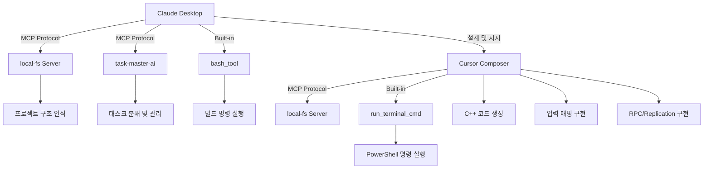

# 🎮 UE5 Multiplayer Top-Down Shooter
### AI-Powered Rapid Prototyping with Vibe Coding

> **⚡ 2시간 동안 개발한 멀티플레이어 슈팅 게임 프로토타입**  
> Claude Desktop + Cursor MCP Composer를 활용한 AI 주도 개발 경험

---

## 📋 프로젝트 개요

이 프로젝트는 **"바이브 코딩(Vibe Coding)"** 방식을 활용하여 Unreal Engine 5 기반 멀티플레이어 탑다운 슈팅 게임을 단 2시간 동안 구현한 사례입니다.

전통적인 수작업 코딩 대신, **Claude Desktop**과 **Cursor MCP Composer**를 연동하여 AI가 프로젝트 구조를 설계하고, C++ 클래스를 생성하며, 빌드 명령을 실행하는 **AI 주도 개발**을 실험했습니다.

Claude Desktop은 MCP 서버를 통해 프로젝트 구조를 인식하고 태스크를 분해하는 역할을, Cursor는 실제 C++ 코드 생성 및 구현을 담당했습니다.

### 🎯 개발 목표
- ✅ 탑다운 시점 플레이어 이동 (WASD)
- ✅ 마우스 조준 및 캐릭터 회전
- ✅ 발사/재장전/탄약 시스템
- ✅ 멀티플레이어 네트워킹 (Dedicated Server)
- ✅ RPC 기반 전투 동기화
- ✅ 체력/데미지 시스템
- ✅ 리스폰 메커니즘
- ✅ HUD (체력, 탄약 표시)

---

## 🛠️ 개발 환경 및 도구

### 핵심 기술 스택
```
📦 Engine       → Unreal Engine 5.5
💻 Language     → C++ (Primary), Blueprint (Minimal)
🌐 Networking   → Dedicated Server + Replication
🎮 Input        → Enhanced Input System
🤖 AI Tools     → Claude Desktop + Cursor MCP Composer
```

### AI 개발 환경 구성

#### 1. Claude Desktop + Cursor MCP 협업 구조


#### 2. 사용된 도구 및 역할

**Claude Desktop**
- **MCP 서버**:
  - **local-fs**: 프로젝트 폴더 구조 인식 및 파일 시스템 접근
  - **task-master-ai**: 15개 태스크로 구조화된 프로젝트 관리
  - **github**: Git 저장소 연동
- **내장 기능**:
  - **bash_tool**: Linux 쉘 명령 실행 (빌드, 컴파일 등)
- **역할**: 프로젝트 아키텍처 설계, 태스크 분해, 빌드 오케스트레이션

**Cursor Composer**
- **MCP 서버**:
  - **local-fs**: 프로젝트 폴더 구조 인식 및 파일 시스템 접근 (Claude와 동일 설정)
- **내장 기능**:
  - **run_terminal_cmd**: PowerShell 터미널 명령 실행
- **구현 기능**:
  - Enhanced Input System 통합 (Input Action/Mapping Context 생성)
  - 캐릭터, 무기, 발사체 등 핵심 C++ 클래스 구현
  - 네트워크 RPC (Server, Client, Multicast) 함수 구현
  - Replication 설정 및 GetLifetimeReplicatedProps 구현
- **역할**: 실제 C++ 코드 작성 및 단계적 기능 구현

---

## 🎯 구현된 핵심 기능

### 1️⃣ 플레이어 캐릭터 시스템

**핵심 구조:**
- Enhanced Input System 통합 (Move, Look, Fire, Reload Actions)
- WeaponComponent를 통한 모듈식 무기 시스템
- 네트워크 리플리케이션 지원 (체력, 위치, 회전)
- Server RPC: `ServerRequestFire()`, `ServerRequestReload()`

**주요 특징:**
- ✅ 탑다운 카메라 (SpringArmComponent + CameraComponent)
- ✅ 마우스 커서 위치로 자동 회전
- ✅ 서버-클라이언트 간 위치/회전 동기화

**코드 예제:**

Enhanced Input System 통합:
```cpp
// Enhanced Input Component로 액션 바인딩
if (UEnhancedInputComponent* EnhancedInputComponent = 
    Cast<UEnhancedInputComponent>(PlayerInputComponent))
{
    EnhancedInputComponent->BindAction(MoveAction, ETriggerEvent::Triggered, 
                                        this, &ATopDownCharacter::Move);
    EnhancedInputComponent->BindAction(FireAction, ETriggerEvent::Started, 
                                        this, &ATopDownCharacter::OnFirePressed);
    // ... 기타 액션 바인딩
}
```

마우스 기반 캐릭터 회전:
```cpp
// 마우스 위치를 월드 좌표로 변환하여 캐릭터 회전
PC->DeprojectScreenPositionToWorld(MouseX, MouseY, WorldLocation, WorldDirection);
// 수평면과의 교차점 계산 → 방향 벡터 → 회전 적용
FRotator NewRotation = FMath::RInterpTo(CurrentRotation, TargetRotation, DeltaTime, 10.0f);
SetActorRotation(FRotator(0.0f, NewRotation.Yaw, 0.0f));
```

---

### 2️⃣ 무기 컴포넌트 (WeaponComponent)

**핵심 구조:**
- 모듈식 설계: `UActorComponent` 기반으로 재사용 가능
- 탄약 시스템: `CurrentAmmo` (현재 탄창) / `ReserveAmmo` (예비 탄약) - 모두 Replicated
- 무기 상태: `EWeaponState` (Idle/Firing/Reloading) - Replicated
- 핵심 메서드: `TryFire()`, `StartReload()`, `CompleteReload()`

**구현된 기능:**
- 🔫 **발사 속도 제한**: RPM 기반 쿨다운 시스템
- 📦 **탄약 관리**: 현재 탄창/예비 탄약 분리 관리
- 🔄 **재장전 메커니즘**: 수동(R 키) 및 자동 재장전 지원
- 🌐 **네트워크 동기화**: 모든 탄약 상태 리플리케이션

**코드 예제:**

재장전 시스템:
```cpp
// 서버에서만 실행되는 재장전 로직
bool UWeaponComponent::StartReload()
{
    if (!HasAuthority() || !CanReload()) return false;
    WeaponState = EWeaponState::Reloading;
    ReloadCompleteTime = GetWorldTime() + ReloadTime;
    return true;
}

void UWeaponComponent::CompleteReload()
{
    // 탄약 전송: ReserveAmmo → CurrentAmmo
    int32 AmmoToReload = FMath::Min(MagazineSize - CurrentAmmo, ReserveAmmo);
    CurrentAmmo += AmmoToReload;
    ReserveAmmo -= AmmoToReload;
    WeaponState = EWeaponState::Idle;
}
```

---

### 3️⃣ 발사체 시스템 (Projectile)

**핵심 구조:**
- `USphereComponent`: 충돌 감지
- `UProjectileMovementComponent`: 물리 기반 이동
- `OnHit()`: 충돌 시 데미지 처리 (서버 권한)

**특징:**
- 💥 **충돌 감지**: Sphere Collision + ProjectileMovementComponent
- 🎯 **데미지 적용**: 서버 권한 기반 데미지 처리
- 🌐 **리플리케이션**: 서버에서 생성, 모든 클라이언트에 자동 동기화
- ⏱️ **생명주기 관리**: InitialLifeSpan으로 자동 제거

---

### 4️⃣ 멀티플레이어 아키텍처

#### 네트워크 구조
```
┌─────────────────────┐
│  Dedicated Server   │ ← Server Authority (게임 로직)
│  (TopDownGameMode)  │
└──────────┬──────────┘
           │
    ┌──────┴──────┐
    │             │
┌───▼───┐   ┌───▼───┐
│Client1│   │Client2│ ← Clients (입력 → Server)
└───────┘   └───────┘
```

#### RPC 통신 패턴
```cpp
// Client → Server (입력 요청)
UFUNCTION(Server, Reliable, WithValidation)
void ServerRequestFire(FVector_NetQuantize10 FireDirection);

// Server → All Clients (이펙트 동기화)
UFUNCTION(NetMulticast, Reliable)
void MulticastPlayFireEffects(FVector_NetQuantize MuzzleLocation, 
                                FVector_NetQuantize FireDirection);
```

**구현된 네트워크 기능:**
- 🔐 **서버 권한**: 모든 게임 로직은 서버에서 실행
- 📡 **RPC 시스템**: 
  - Client → Server: 발사/재장전 요청
  - Server → Clients: 이펙트 및 상태 동기화
- 🔄 **리플리케이션**: 체력, 탄약, 위치, 회전 자동 동기화
- ✅ **검증(Validation)**: 서버 측 입력 유효성 검사

**코드 예제:**

네트워크 발사 로직:
```cpp
// 클라이언트: 발사 요청
void ATopDownCharacter::OnFirePressed()
{
    ServerRequestFire(FireDirection);  // Server RPC 호출
    // 자동 발사 타이머 시작 (RPM 기반)
}

// 서버: 발사 처리 및 동기화
void ATopDownCharacter::ServerRequestFire_Implementation(FVector_NetQuantize10 FireDirection)
{
    if (WeaponComponent && WeaponComponent->TryFire(FireDirection))
    {
        MulticastPlayFireEffects(MuzzleLocation, FireDirection);  // 모든 클라이언트에 이펙트
    }
}
```

---

### 5️⃣ 체력 및 전투 시스템

**핵심 구조:**
- `UPROPERTY(ReplicatedUsing = OnRep_Health)`: 체력 자동 동기화
- `TakeDamage()`: 서버에서만 실행, 체력 차감 및 사망 처리
- `Die()`: 서버 권한으로 사망 처리, `MulticastHandleDeath()` 호출
- GameMode 연동: `RequestRespawn()`으로 3초 후 자동 리스폰

**시스템 흐름:**
1. 발사체가 플레이어에 충돌 (서버에서만 처리)
2. 서버에서 `TakeDamage()` 호출 → 체력 차감
3. 체력 리플리케이션 → 클라이언트에서 `OnRep_Health()` 호출
4. HUD 업데이트 (`UpdateHUDDisplay()`)
5. 체력 0 이하 → `Die()` 호출
6. `MulticastHandleDeath()` → 모든 클라이언트에 사망 효과 재생
7. GameMode의 `RequestRespawn()` 호출 → 3초 후 자동 리스폰
8. 리스폰 시 `ResetForRespawn()` → 체력/탄약 초기화

---

### 6️⃣ UI 시스템 (HUD)

**핵심 구조:**
- `UUserWidget` 기반: Blueprint에서 디자인 가능
- Blueprint 이벤트: `OnHealthChanged()`, `OnAmmoChanged()` - C++에서 데이터 전달, Blueprint에서 시각화
- `UpdateHUD()`: 체력/탄약 정보를 이벤트로 전달

**구현 특징:**
- ✅ **UUserWidget 기반**: Blueprint에서 디자인 가능한 위젯 시스템
- ✅ **PlayerController 관리**: 리스폰 후에도 HUD 유지
- ✅ **Blueprint 이벤트**: C++에서 데이터 전달, Blueprint에서 시각화
- ✅ **표시 정보**:
  - ❤️ 체력 바/수치 (OnHealthChanged 이벤트)
  - 🔫 탄약 (현재/예비) (OnAmmoChanged 이벤트)
  - 🔄 재장전 상태 표시

---

## 📊 프로젝트 구조

```
TopDownProto/
├── Source/
│   └── TopDownProto/
│       ├── TopDownCharacter.h/cpp          # 플레이어 캐릭터
│       ├── TopDownGameMode.h/cpp           # 게임 모드 (서버)
│       ├── TopDownGameState.h/cpp          # 게임 스테이트
│       ├── TopDownPlayerController.h/cpp   # 플레이어 컨트롤러
│       ├── TopDownHUD.h/cpp                # HUD 시스템 (UUserWidget)
│       ├── WeaponComponent.h/cpp           # 무기 컴포넌트
│       └── Projectile.h/cpp                # 발사체
├── Content/
    ├── TopDown/
    │   ├── Input/                          # Enhanced Input 에셋
    │   │   ├── IA_Move.uasset
    │   │   ├── IA_Look.uasset
    │   │   ├── IA_Fire.uasset
    │   │   ├── IA_Reload.uasset
    │   │   └── IMC_Default.uasset
    │   └── Blueprints/                     # BP 기반 설정
    └── Maps/                               # 테스트 맵
```

---

## 🎮 실행 방법

### 1. 프로젝트 빌드
```bash
# Visual Studio 2022에서 솔루션 열기
TopDownProto.sln

# 또는 명령줄에서 빌드
> UnrealBuildTool.exe TopDownProtoEditor Win64 Development
```

### 2. 에디터에서 실행
```
1. TopDownProto.uproject 더블클릭
2. Play 버튼 클릭 → "Play as Listen Server" 선택
3. 추가 클라이언트: Editor Preferences → Play → Multiplayer Options
   → Number of Players: 2~4로 설정
```

### 3. 패키징된 파일로 실행 (선택적)
프로젝트 패키징: File → Package Project → Windows → Development
```bash
# 패키징 완료 후:
> Binaries\Win64\TopDownProtoServer.exe  # 서버
> Binaries\Win64\TopDownProto.exe 127.0.0.1  # 클라이언트
```

### 조작법
- **이동**: `WASD`
- **조준**: `마우스 커서`
- **발사**: `좌클릭` (연속 클릭 가능)
- **재장전**: `R`

---

## 🏆 성과 및 배운 점

### ✅ 달성한 목표
1. **빠른 프로토타이핑**: 2시간 내 플레이 가능한 멀티플레이어 게임 완성
2. **AI 협업 개발**: Claude(설계/오케스트레이션) + Cursor(코드 구현)로 효율적 개발
3. **완전한 네트워크 구현**: 서버 권한, RPC, 리플리케이션 모두 작동
4. **모듈식 설계**: WeaponComponent를 통한 재사용 가능한 시스템

### 📚 학습 내용
1. **바이브 코딩 경험**: LLM을 활용한 신속한 개발 워크플로우 체득
2. **AI 도구 협업 패턴**:
   - **Claude Desktop**: 프로젝트 구조 인식, 태스크 분해, bash를 통한 빌드 오케스트레이션
   - **Cursor Composer**: 실제 C++ 코드 작성, 입력 매핑, RPC/Replication 구현
   - 설계(Claude) → 구현(Cursor) → 빌드(Claude/Cursor) 사이클
3. **MCP 프로토콜 활용**: 
   - `local-fs` 서버로 프로젝트 구조 인식 (Claude와 Cursor 공통)
   - `task-master-ai` 서버로 태스크 분해 및 관리
   - `github` 서버로 Git 저장소 연동
4. **쉘 명령 자동화**:
   - Claude의 `bash_tool`로 Linux 쉘 명령 실행
   - Cursor의 `run_terminal_cmd`로 PowerShell 명령 실행
   - UBT(Unreal Build Tool) 빌드 자동화
5. **UE5 네트워킹 패턴**: 
   - 서버 권한 모델 이해
   - RPC 설계 원칙 (Server, Client, Multicast)
   - 리플리케이션 최적화 (RepNotify, NetQuantize)
6. **Enhanced Input System**: UE5의 현대적 입력 시스템 통합

---

## 🤝 기여 및 라이선스

이 프로젝트는 **학습 및 포트폴리오 목적**으로 제작되었습니다.

### 사용된 주요 기술 및 도구
- Unreal Engine 5 (Epic Games)
- Claude AI (Anthropic)
- MCP (Model Context Protocol)

---

<div align="center">

**🎮 Powered by AI-Driven Development 🤖**

*"From Idea to Playable Game in 2 Hours"*

</div>
